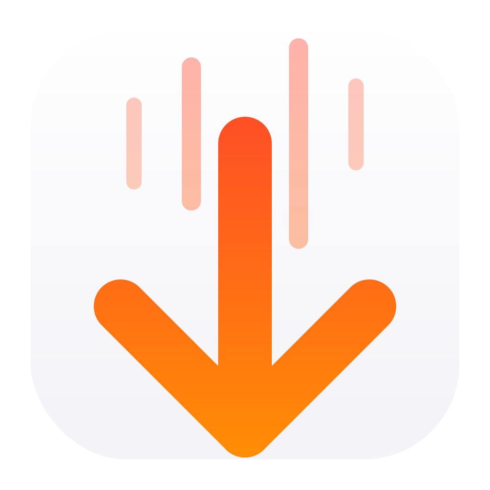

<p align="center">
  
</p>

<h1 align="center">QuickDown</h1>

<p align="center">
  A macOS Quick Look extension for previewing Markdown files.<br>
  Press Space in Finder to see beautifully rendered markdown.
</p>

---

## Features

- **Instant Preview** — Select any `.md` file in Finder and press Space
- **GitHub-Flavored Markdown** — Tables, task lists, strikethrough, and more
- **Syntax Highlighting** — Code blocks with language-specific coloring
- **Dark Mode Support** — Automatically adapts to your system appearance
- **Fast & Lightweight** — All rendering happens locally, no network required

## Installation

### From Releases

1. Download the latest `QuickDown.app` from [Releases](https://github.com/tennyson-mccalla/QuickDown/releases)
2. Move to `/Applications`
3. Launch once to register the extension
4. Select any `.md` file in Finder and press Space

### Build from Source

Requires Xcode 15+ and macOS 14+.

```bash
# Clone the repo
git clone https://github.com/tennyson-mccalla/QuickDown.git
cd QuickDown

# Generate Xcode project (requires xcodegen)
brew install xcodegen
xcodegen generate

# Open and build
open QuickDown.xcodeproj
```

Build in **Release** mode, then copy `QuickDown.app` to `/Applications`.

## Supported File Extensions

- `.md`
- `.markdown`
- `.mdown`
- `.mkdn`
- `.mkd`

## Tech Stack

- **Swift** — Native macOS app
- **WebKit** — WKWebView for rendering
- **marked.js** — Markdown parsing
- **highlight.js** — Syntax highlighting

## License

MIT
