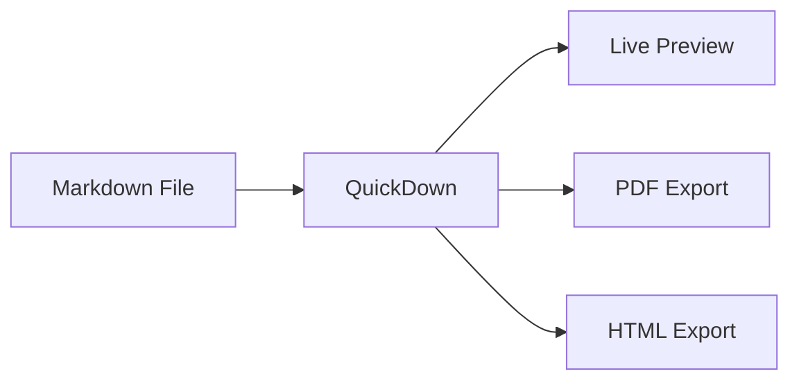

# QuickDown

A fast, native Markdown previewer for macOS. Open any `.md` file and see a beautiful, live preview instantly.

## Syntax Highlighting

QuickDown renders code blocks with full syntax highlighting across dozens of languages.

```swift
struct MarkdownView: View {
    @State private var content: String = ""
    @State private var isLoading = false

    var body: some View {
        ScrollView {
            VStack(alignment: .leading, spacing: 16) {
                ForEach(blocks) { block in
                    BlockRenderer(block: block)
                        .transition(.opacity)
                }
            }
            .padding(32)
        }
    }
}
```

## Mermaid Diagrams

Render flowcharts, sequence diagrams, and more — directly in your preview.



## Math & LaTeX

Inline and block math rendering with KaTeX.

The quadratic formula: $x = \frac{-b \pm \sqrt{b^2-4ac}}{2a}$

$$\int_0^\infty e^{-x^2} dx = \frac{\sqrt{\pi}}{2}$$

## Tables

| Feature               | Supported |
|-----------------------|-----------|
| Live Reload           | ✓ |
| Syntax Highlighting   | ✓ |
| Mermaid Diagrams      | ✓ |
| Math / LaTeX          | ✓ |
| Table of Contents     | ✓ |
| Dark & Sepia Themes   | ✓ |
| Quick Look Extension  | ✓ |
| PDF & HTML Export     | ✓ |

## Task Lists

- [x] Native macOS app — no Electron, no browser
- [x] Instant startup (~0.1s)
- [x] Quick Look integration for Finder previews
- [x] Works offline, no telemetry
- [ ] World domination

## Blockquotes

> "QuickDown is the Markdown previewer I've always wanted on macOS — fast, beautiful, and completely out of the way."

---

*QuickDown — Write more. Preview better.*
