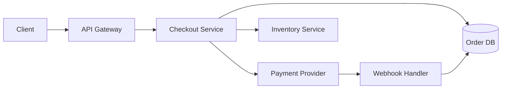

# Checkout Service — System Design

A walkthrough of the checkout service's request flow, data model, and failure handling. This doc is the starting point for new engineers onboarding to the team.

## High-level request flow



The client hits the API gateway, which routes to the checkout service. Checkout writes a pending order, charges the payment provider, and decrements inventory. The provider's webhook confirms the charge asynchronously, which promotes the order from `pending` to `confirmed`.

## Why this shape

We originally ran checkout as a synchronous call to the payment provider, blocking the user's request on network latency we didn't control. The async webhook pattern lets us return a pending state to the client in under 200ms while the slow path completes in the background.

## Components

### API Gateway

Terminates TLS, enforces rate limits, authenticates the user session, and forwards to the checkout service. The gateway is a thin layer — business logic lives downstream.

### Checkout Service

The orchestrator. Responsible for:

- Creating the `Order` record in the pending state
- Calling the payment provider's `create_charge` endpoint
- Calling the inventory service's `reserve` endpoint
- Returning a pending-state response to the client

### Payment Provider (third-party)

We use Stripe. Charges are created with a client-side idempotency key so retries don't double-charge. The provider calls our webhook handler when the charge succeeds or fails.

### Inventory Service

Owns the "how many of each SKU are available" question. Uses optimistic locking — if two checkouts race for the last unit, one wins and the other gets a 409 that checkout translates to a user-friendly message.

### Webhook Handler

Receives callbacks from the payment provider. Verifies the signature, idempotently promotes the order state, and emits a domain event so downstream consumers (fulfillment, analytics) can react.

## Data model

The order state machine is deliberately minimal:

```
pending → confirmed → shipped → delivered
    ↓         ↓
 failed   refunded
```

Transitions are guarded by enum constraints at the database level. We do not allow arbitrary state changes from application code — every transition goes through a named method that validates the source state.

## Failure modes

### Payment provider outage

If Stripe is unreachable, `create_charge` times out after 8 seconds. The order stays in `pending`. A background job retries pending charges with exponential backoff up to 24 hours, after which the order transitions to `failed` and the user is notified by email.

### Inventory reservation conflict

Two clients race for the last unit. The loser receives a 409 from the inventory service. Checkout catches this, marks the order as `failed`, and returns a specific error code to the client so the UI can show "sold out" rather than a generic error.

### Webhook lost

We never fully trust webhooks. A separate reconciliation job runs every 15 minutes and queries the payment provider for the current status of any order that's been `pending` for more than 10 minutes. This catches cases where the webhook was dropped or delayed.

## What we'd change

Given the chance to redesign, we'd pull the orchestrator out as a saga rather than a synchronous controller. The current flow works but has accumulated retry logic in enough places that a dedicated workflow engine would simplify reasoning about failure states.
