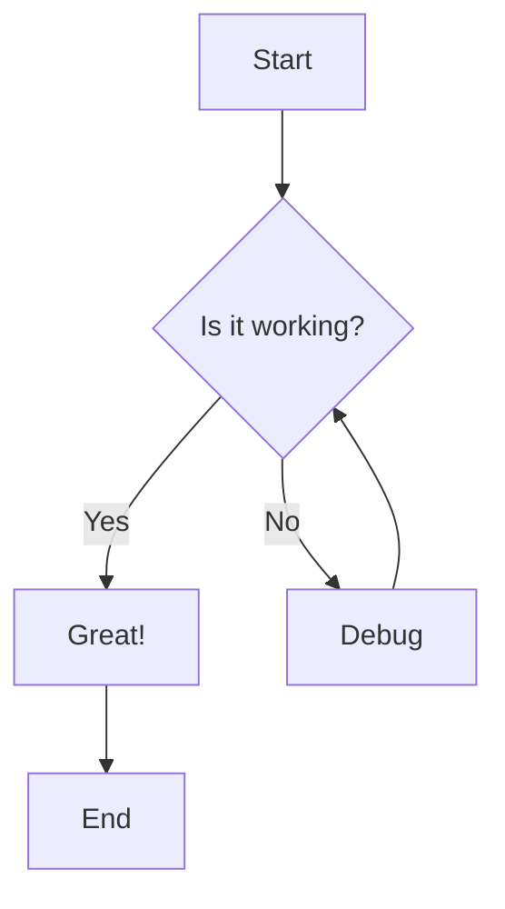
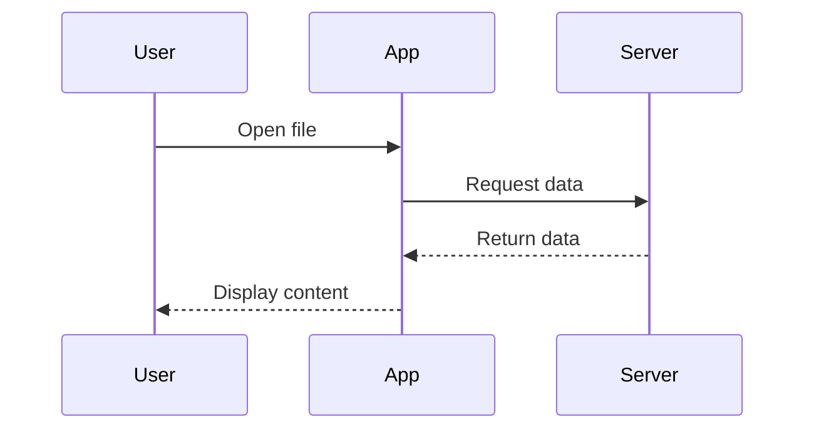
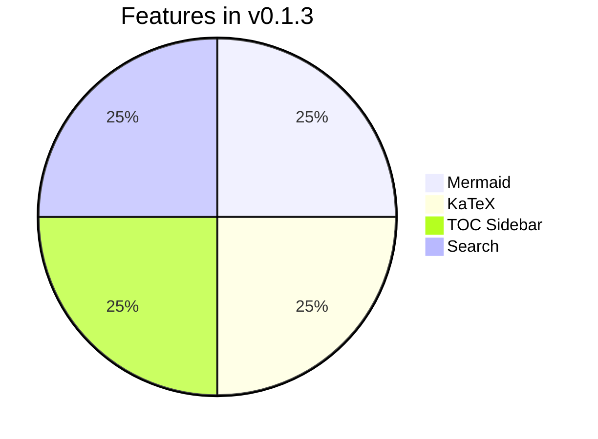

# Mermaid Diagram Test

## Flowchart


```mermaid
flowchart TD
    A[Start] --> B{Is it working?}
    B -->|Yes| C[Great!]
    B -->|No| D[Debug]
    D --> B
    C --> E[End]
```

## Sequence Diagram


```mermaid
sequenceDiagram
    participant User
    participant App
    participant Server
    User->>App: Open file
    App->>Server: Request data
    Server-->>App: Return data
    App-->>User: Display content
```

## Pie Chart


```mermaid
pie title Features in v0.1.3
    "Mermaid" : 25
    "KaTeX" : 25
    "TOC Sidebar" : 25
    "Search" : 25
```

## Regular code block (should still highlight)

```swift
func hello() {
    print("Hello, world!")
}
```
