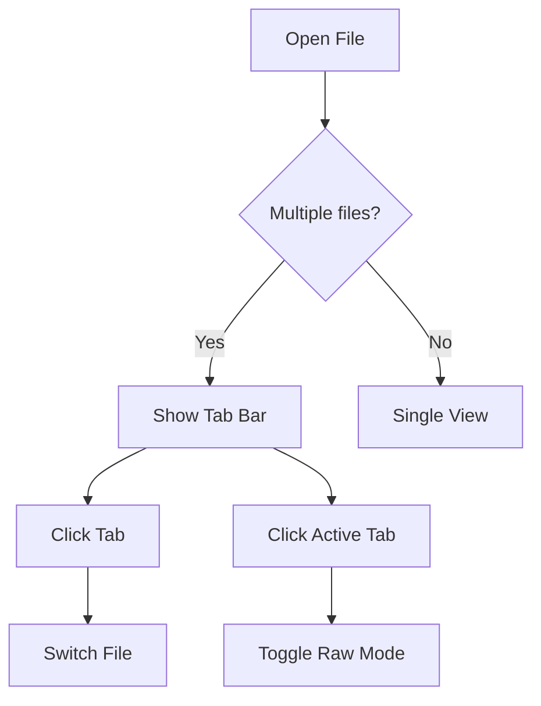

# Heading 1

## Heading 2

### Heading 3

#### Heading 4

##### Heading 5

###### Heading 6

---

## Text Formatting

This is **bold text** and this is *italic text* and this is ***bold italic***. Here is some `inline code` and here is ~~strikethrough text~~. Single ~tildes~ should not be struck through.

Here is a [link to Apple](https://www.apple.com) and here is an [external link to GitHub](https://github.com).

---

## Fenced Code Block

```swift
func greet(name: String) -> String {
    return "Hello, \(name)!"
}

let message = greet(name: "QuickDown")
print(message)
```

```python
def fibonacci(n):
    a, b = 0, 1
    for _ in range(n):
        yield a
        a, b = b, a + b

print(list(fibonacci(10)))
```

---

## Table

| Feature | v0.5.0 | v0.6.0 |
|---------|--------|--------|
| Multi-file tabs | No | Yes |
| Raw mode toggle | No | Yes |
| Relative images | No | Yes |
| Floating tab bar | No | Yes |
| KaTeX math | Yes | Yes |
| Mermaid diagrams | Yes | Yes |

---

## KaTeX Math

Inline math: The quadratic formula is $x = \frac{-b \pm \sqrt{b^2 - 4ac}}{2a}$ and Euler's identity is $e^{i\pi} + 1 = 0$.

Display math:

$$\int_{-\infty}^{\infty} e^{-x^2} dx = \sqrt{\pi}$$

$$\sum_{n=1}^{\infty} \frac{1}{n^2} = \frac{\pi^2}{6}$$

---

## Mermaid Diagram



---

## Interactive Checkboxes

- [x] Core rendering works
- [x] Themes implemented
- [ ] v0.6.0 smoke test
- [ ] Release to App Store
- [ ] Plan v0.7.0

---

## Blockquote

> This is a blockquote. It should be visually distinct from normal text with an indent and a left border.
>
> It can span multiple paragraphs.

---

## Ordered and Unordered Lists

1. First item
2. Second item
   1. Nested item A
   2. Nested item B
3. Third item

- Bullet one
- Bullet two
  - Nested bullet
  - Another nested bullet
- Bullet three

---

## Image (Relative Path Test)

If this file is opened from a directory with images, relative paths should resolve:


*(If no image exists at that path, this is expected to show a broken image — that's fine for the smoke test.)*

---

**End of smoke test file.** All rendering features above should display correctly across all themes.
